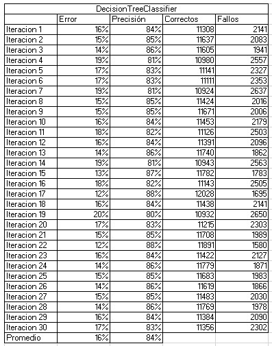

# Unit 4 - Final Project

### Howard Herrera Erwin - 18210716
### Ramos Robles Kathy Abigail - 17211556


## Introduction
The objective of this project is to execute four of the data classification models seen in class, which are Support Vector Machine, Decision Three, Logistic Regression and Multilayer perceptron, which will help us to appreciate and compare the different results that they give us.
Based on the results, a conclusion can be reached about which model is more reliable and accurate.
Likewise, the tools used to execute these algorithms, as well as each of the models, will probably be explained.
## Theoretical framework of algorithms
 - Support vector machine SVM

    It is a supervised learning algorithm used in many classification and regression problems, including medical applications of signal processing, natural language processing, and image and speech recognition.

    SVM works by mapping data to a high-dimensional feature space so that data points can be categorized, even if the data cannot be otherwise linearly separated. A separator between the categories is detected and the data is transformed so that the separator can be extracted as a hyperplane. After that, the characteristics of the new data can be used to predict the group to which the new record belongs.
- Decision tree

    A decision tree is a tree-like diagram that shows statistical probability or determines a course of action. It shows analysts and decision makers what steps they need to take and how different choices could affect the entire process. All this supported by data. As you will understand, it is a very useful tool in any organization governed by data or Data Driven. In this post, I am going to tell you how to build it, its main symbols, its advantages and disadvantages, as well as its importance in Data Driven. Interesting right? Let's go for it.

    A decision tree is a kind of map that shows each of the possible decision options and their results. This is tremendously useful for those people who have to make decisions in a business, since it allows you to compare different decisions and actions according to their costs, probabilities and benefits.

- Logistic Regression

    Logistic regression is useful when you want to predict the presence or absence of a feature or outcome based on the values of a set of predictors. It is similar to a linear regression model but is adapted for models where the dependent variable is dichotomous. Logistic regression coefficients can be used to estimate the odds ratio for each independent variable in the model. Logistic regression can be applied to a broader range of research situations than discriminant analysis.


- Multilayer perceptron

    The multilayer perceptron evolves the simple perceptron and for this it incorporates layers of hidden neurons, with this it manages to represent non-linear functions.
    The multilayer perceptron is composed of an input layer, an output layer, and n hidden layers in between.
    It is characterized by having disjoint but related outputs, such that the output of one neuron is the input of the next.

## Implementation
- **Scala**:

    It is a language based on the Java Virtual Machine that integrates the concepts of functional language and object-oriented programming. It is a scalable language suitable for performing distributed processing in the cloud and runs on Azure Spark clusters.
- **Spark**:

    It is an open source parallel processing platform that supports in-memory processing to improve the performance of big data analytics applications. The Spark processing engine is built for speed, ease of use, and sophisticated analytics. Spark's distributed in-memory computation capabilities make it a good choice for iterative algorithms in graph computations and machine learning. The spark.ml package provides a uniform set of high-level APIs built from DataFrames that help build and tune practical machine learning pipelines. MLlib is Spark's scalable machine learning library that provides modeling capabilities in this distributed environment.

## Results and explanation


*Support Vector Machine throws errors ranging from 11% to 12%, giving an average of 12% and with an accuracy of 88% in most of its iterations, giving 88% as an average, which is a high and acceptable accuracy for this model.*



*Decision Tree was the model that yielded more varied errors, from 14% to 20%, giving an average of 16%, which is considered to be a considerable error, in addition to the fact that it varies a lot, as well as the precision that came to vary from 81% to 88%, so it is not considered a reliable accuracy, giving an average of 84% accuracy.*


*Logistic Regression gave us errors ranging from 11% to 12%, giving an average of 12% and with an accuracy between 88% and 89% in most of its iterations, giving 88% as an average, which makes it another of the most reliable models we have used.*

 \
*Multilayer Perceptron also returned errors from 11% to 12%, giving an average of 12% and with an average of 88% in its accuracy, which shows us that it is just as accurate as Logistic Regression and Support Vector Machine.*

## Conclusions
After observing the results of each one of the models, we can observe that the majority give us an error of 12% and an accuracy of 88%, except for the Decision Three model, since it provides an error of 16% and 84% accuracy. accuracy, which makes this model the least reliable and accurate compared to the other three used in the development of the project.
## References
Anonymous. (2022). Data science using Scala and Spark on Azure. Microsoft. Website: https://docs.microsoft.com/es-es/azure/architecture/data-science-process/scala-walkthrough

Anonymous. (2020). Support Vector Machine (SVM). , from Mathworks Website: https://la.mathworks.com/discovery/support-vector-machine.html#:~:text=Support%20vector%20machine%20(SVM)%20en,recognition%20of%20images% 20y%20voice.

Emilio Fernandez Lastra. (2019). What is a decision tree and its importance in Data Driven. , by Artyco Website: https://artyco.com/que-es-un-arbol-de-decision-y-su-importancia-en-el-data-driven/

Logistic regression. (2021, June 10). IBM. https://www.ibm.com/docs/en/spss-statistics/SaaS?topic=regression-logistic

Calvo, D. (2018, December 8). Multilayer Perceptron – Neural Network. Calvo Diego. https://www.diegocalvo.es/perceptron-multilayer/

 Unit-2
# Evaluative practice Unit 2

### Imports 
```scala
import org.apache.spark.ml.classification.MultilayerPerceptronClassifier
import org.apache.spark.ml.evaluation.MulticlassClassificationEvaluator
import org.apache.spark.ml.feature.{IndexToString, StringIndexer, VectorIndexer, VectorAssembler}
```

###  1. Upload to an Iris dataframe.csv located in https://github.com/jcromerohdz/iris, elaborate the data liempieza necessary to be processed by the following algorithm (Important, this cleaning must be by middle of a Scala script in Spark). A). Use Spark's Mllib library multilayer Machine Learning algorithm perceptron*/
```scala
val datairis = spark.read.option("header", "true").option("inferSchema","true")csv("iris.csv")
```

### 2. What are the names of the columns?
```scala
println(datairis.columns.toSeq)
```

### 3. What is the scheme like?
```scala
datairis.printSchema()
```

### 4. Print the first 5 columns.
```scala
datairis.select(datairis.columns.slice(0,5).map(m=>col(m)):_*).show()
```

### 5. Use the describe() method to learn more about the data in the DataFrame.

*In this case, to obtain information from the DataFrame, the name of our dataFrame “datairis” is used, followed by the .describe() method followed by .show()*
```scala
datairis.describe().show()
```

### 6. Make the pertinent transformation for the categorical data which will be our labels to classify.

*We declare a VAssembler vector to classify our categorical variables, in this case it will be the “sepal_length”, “sepal_width”, “petal_length” and “petal_width” columns, from this vector a new dataframe will be created with the features column.*

*The transformation of our main dataframe "datairis" is performed with the created vector VAassembler.*

*Finally, the result of the transformation is displayed.*
```scala
val VAssembler = new VectorAssembler().setInputCols(Array("sepal_length","sepal_width","petal_length","petal_width")).setOutputCol("features")
val Output = VAssembler.transform(datairis)
Output.show()
```
*A new "label" column is created which will contain the labels indexed as StringIndexer, since the Species column of the "datairis" dataframe will be used and it contains data of type string.*

*The "indexed” variable will save the result of the transformation of the labelIndexer and Output, which stores the dataframe with the last columns added.*

*Finally, the .show() method is used to show that the “label” column has been added.*
```scala
val labelIndexer = new StringIndexer().setInputCol("species").setOutputCol("label").fit(datairis)
val indexed = labelIndexer.transform(Output)
indexed.show()
```

### 7. Build the classification model and explain its architecture.

*To use the Multilayer Perceptron Classifier model, the seed is established and the proportion in which the data will be randomly separated is established, in this case 70% - 30% which will be used for training and tests respectively, then the layers of the neural network.*

*Then the new trainer is created and parameters are assigned to it.*

*Finally, the model is trained.*
```scala
val splits = indexed.randomSplit(Array(0.7, 0.3), seed = 1234L)
val train = splits(0)
val test = splits(1)

val layers = Array[Int](4, 5, 4, 3)
// create the trainer and set its parameters
val trainer = new MultilayerPerceptronClassifier().setLayers(layers).setBlockSize(128).setSeed(1234L).setMaxIter(100)

// train the model
val model = trainer.fit(train)
```

### 8. Print the model results

*The precision of the results obtained in the tests is calculated, and finally this calculated precision is displayed.*
```scala
val result = model.transform(test)
val predictionAndLabels = result.select("prediction", "label")
val evaluator = new MulticlassClassificationEvaluator()
.setMetricName("accuracy")

println(s"Test set accuracy = ${evaluator.evaluate(predictionAndLabels)}")
```

# Evaluation Unit 1

*First we opened the terminal end and wrote "spark-shell".*

### 1. Start a simple Spark session.
    Import and create the spark sql session.
    
    import org.apache.spark.sql.SparkSession
    val sparksession = SparkSession.builder().getOrCreate()

###  2. Upload the Netflix Stock CSV file, make Spark infer the data types.
    Netflix Stock CVS file data loaded

    val netflixdata = spark.read.option("header", "true").option("inferSchema","true")csv("Netflix_2011_2016.csv")

###  3. What are the names of the columns?
    Use the name that was assigned to the dataframe, followed by “.columns” so that it returns the column names in an array.

    netflixdata.columns

###  4. What is the scheme like?
    .printSchema() was used to get the schema of the dataframe.

    netflixdata.printSchema()

###  5. Prints the first 5 columns.
    It is necessary to name the name of the columns that you want to print, for later show them with .show()

    netflixdata.select($"Date",$"Open",$"High",$"Low",$"Close").show()

###  6. Use describe () to learn about the DataFrame.
    Information is obtained from the file data

    netflixdata.describe().show()

###  7. Create a new dataframe with a new column called "HV Ratio" which is the relationship between the price of the "High" column versus the "Volume" column of shares traded for one day. Hint - is an operation
    Creation of a new dataframe, the HV Ratio column is assigned the value obtained from the High columns divided by the Volume of the “netflixdata” dataframe.

    var newhvratio = ("HV Ratio", netflixdata("High")/netflixdata("Volume"))

###  8. What day had the highest peak in the "Open" column?
    The daymax variable is declared, which contains the days of the “Date” column of the “netflixdata” dataframe.
    
    The variable maxnet is assigned the value of maxday, grouped by day and ordered from highest to lowest.
    
    Finally, a select is used to display the largest value, in this case it is the 31st.

    val daymax = netflixdata.withColumn("Day", dayofmonth(netflixdata("Date")))
    val maxnet = daymax.groupBy("Day").max()
    maxnet.show()
    maxnet.select($"Day",$"max(Open)").show()

###  9. What is the meaning of the Close column "Close" in the context of financial information, explain it there is nothing to encode?
    
    The "close" column represents the close of a day

###  10. What is the maximum and minimum of the "Volume" column?
    The maximum and the minimum of the "Close" table are shown

    netflixdata.select(max("Volume"), min("Volume")).show()

###  11. With Scala/Spark $ Syntax answer the following:

a. How many days was the "Close" column less than $600?
    To obtain the result, a filter is applied to the “Close” column, where the value must be less than 600.

    netflixdata.filter($"Close" < 600).count()

b. What percentage of the time was the "High" column greater than $500?
    Similarly, a filter is applied to the "Close" column, where the value must be greater than 500, and to obtain the result it is multiplied by 100.

    (netflixdata.filter($"High" > 500).count().toFloat / netflixdata.count().toFloat) * 100

c. What is the Pearson correlation between the "High" column and the "Volume" column?
    To obtain the Pearson correlation, the "corr" method is used, where the columns between which it will be calculated are specified.

    netflixdata.select(corr("High", "Volume")).show()


d. What is the maximum of the "High" column per year?
    Se declara la variable colYear, a la cual se le asigna el valor de la columna “Date” del dataframe netflixdata”.
    
    Se declara la variable dfYearMax, la cual agrupa por año los valores de colYear y los ordena de mayor a menor.
    
    Por último, para imprimir los valores, se usa un select que contenga la información de los años (Years) y la cantidad máxima max(High).
    
    val colYear = netflixdata.withColumn("Years", year(netflixdata("Date")))

    val dfYearMax = colYear.groupBy("Years").max()

    dfYearMax.select($"Years", $"max(High)").show()


e. What is the "Close" column average for each calendar month?
    The colMonth variable is declared, to which the value of the "Date" column of the dataframe netflixdata”.
    
    The variable dfAverage is declared, which groups the values of colMonth by month. 

    Finally, to print the values, a select is used that contains the information of the months (Month) and the average avg(Close).

    val colMonth = netflixdata.withColumn("Mes", month(netflixdata("Date")))

    val dfAverage = colMonth.groupBy("Mes").mean()

    dfAverage.select($"Mes", $"avg(Close)").show()


