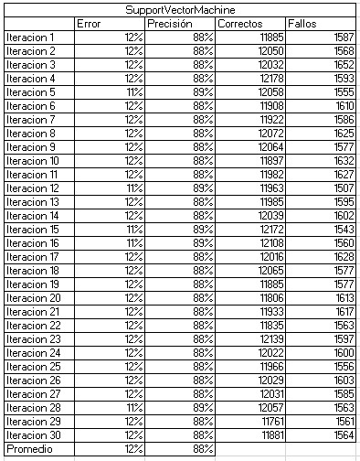
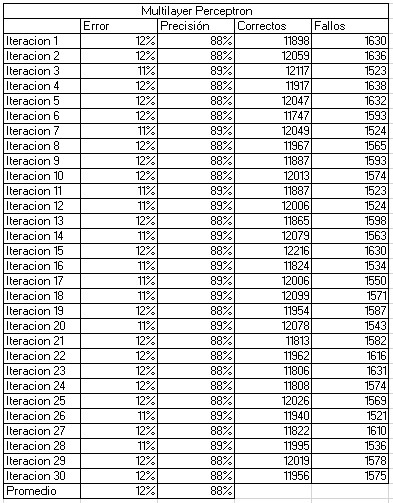

# Unit 4 - Final Project

### Howard Herrera Erwin - 18210716
### Ramos Robles Kathy Abigail - 17211556

## Introduction
The objective of this project is to execute four of the data classification models seen in class, which are Support Vector Machine, Decision Three, Logistic Regression and Multilayer perceptron, which will help us to appreciate and compare the different results that they give us.
Based on the results, a conclusion can be reached about which model is more reliable and accurate.
Likewise, the tools used to execute these algorithms, as well as each of the models, will probably be explained.
## Theoretical framework of algorithms
 - Support vector machine SVM

    It is a supervised learning algorithm used in many classification and regression problems, including medical applications of signal processing, natural language processing, and image and speech recognition.

    SVM works by mapping data to a high-dimensional feature space so that data points can be categorized, even if the data cannot be otherwise linearly separated. A separator between the categories is detected and the data is transformed so that the separator can be extracted as a hyperplane. After that, the characteristics of the new data can be used to predict the group to which the new record belongs.
- Decision tree

    A decision tree is a tree-like diagram that shows statistical probability or determines a course of action. It shows analysts and decision makers what steps they need to take and how different choices could affect the entire process. All this supported by data. As you will understand, it is a very useful tool in any organization governed by data or Data Driven. In this post, I am going to tell you how to build it, its main symbols, its advantages and disadvantages, as well as its importance in Data Driven. Interesting right? Let's go for it.

    A decision tree is a kind of map that shows each of the possible decision options and their results. This is tremendously useful for those people who have to make decisions in a business, since it allows you to compare different decisions and actions according to their costs, probabilities and benefits.

- Logistic Regression

    Logistic regression is useful when you want to predict the presence or absence of a feature or outcome based on the values of a set of predictors. It is similar to a linear regression model but is adapted for models where the dependent variable is dichotomous. Logistic regression coefficients can be used to estimate the odds ratio for each independent variable in the model. Logistic regression can be applied to a broader range of research situations than discriminant analysis.

- Multilayer perceptron

    The multilayer perceptron evolves the simple perceptron and for this it incorporates layers of hidden neurons, with this it manages to represent non-linear functions.
    The multilayer perceptron is composed of an input layer, an output layer, and n hidden layers in between.
    It is characterized by having disjoint but related outputs, such that the output of one neuron is the input of the next.

## Implementation
- **Scala**:

    It is a language based on the Java Virtual Machine that integrates the concepts of functional language and object-oriented programming. It is a scalable language suitable for performing distributed processing in the cloud and runs on Azure Spark clusters.
- **Spark**:

    It is an open source parallel processing platform that supports in-memory processing to improve the performance of big data analytics applications. The Spark processing engine is built for speed, ease of use, and sophisticated analytics. Spark's distributed in-memory computation capabilities make it a good choice for iterative algorithms in graph computations and machine learning. The spark.ml package provides a uniform set of high-level APIs built from DataFrames that help build and tune practical machine learning pipelines. MLlib is Spark's scalable machine learning library that provides modeling capabilities in this distributed environment.

## Results and explanation

*Support Vector Machine throws errors ranging from 11% to 12%, giving an average of 12% and with an accuracy of 88% in most of its iterations, giving 88% as an average, which is a high and acceptable accuracy for this model.*

*Decision Tree was the model that yielded more varied errors, from 14% to 20%, giving an average of 16%, which is considered to be a considerable error, in addition to the fact that it varies a lot, as well as the precision that came to vary from 81% to 88%, so it is not considered a reliable accuracy, giving an average of 84% accuracy.*

*Logistic Regression gave us errors ranging from 11% to 12%, giving an average of 12% and with an accuracy between 88% and 89% in most of its iterations, giving 88% as an average, which makes it another of the most reliable models we have used.*

 \
*Multilayer Perceptron also returned errors from 11% to 12%, giving an average of 12% and with an average of 88% in its accuracy, which shows us that it is just as accurate as Logistic Regression and Support Vector Machine.*

## Conclusions
After observing the results of each one of the models, we can observe that the majority give us an error of 12% and an accuracy of 88%, except for the Decision Three model, since it provides an error of 16% and 84% accuracy. accuracy, which makes this model the least reliable and accurate compared to the other three used in the development of the project.
## References
Anonymous. (2022). Data science using Scala and Spark on Azure. Microsoft. Website: https://docs.microsoft.com/es-es/azure/architecture/data-science-process/scala-walkthrough

Anonymous. (2020). Support Vector Machine (SVM). , from Mathworks Website: https://la.mathworks.com/discovery/support-vector-machine.html#:~:text=Support%20vector%20machine%20(SVM)%20en,recognition%20of%20images% 20y%20voice.

Emilio Fernandez Lastra. (2019). What is a decision tree and its importance in Data Driven. , by Artyco Website: https://artyco.com/que-es-un-arbol-de-decision-y-su-importancia-en-el-data-driven/

Logistic regression. (2021, June 10). IBM. https://www.ibm.com/docs/en/spss-statistics/SaaS?topic=regression-logistic

Calvo, D. (2018, December 8). Multilayer Perceptron – Neural Network. Calvo Diego. https://www.diegocalvo.es/perceptron-multilayer/
